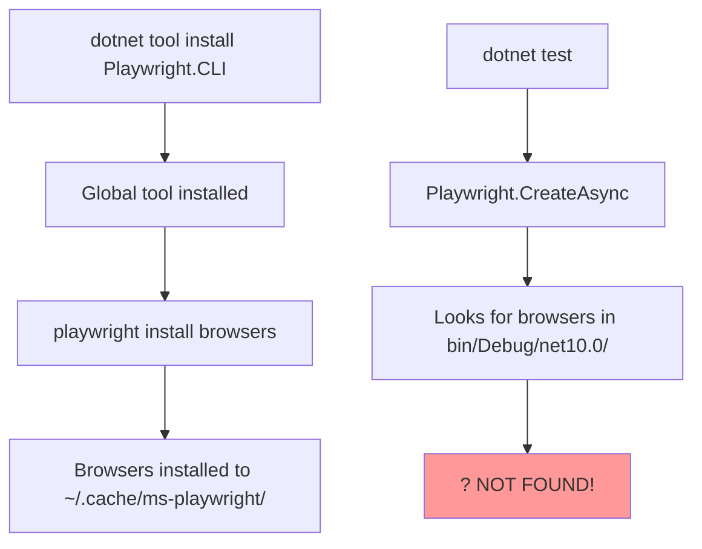

# ?? Claude Branch Analysis - fix-playwright-tests-INP9Z

## TL;DR: ? **DO NOT MERGE**

The branch attempts to fix Playwright tests but makes the problem worse.

---

## ?? Branch Comparison

| Aspect | main (Our Work) | Claude Branch | Verdict |
|--------|----------------|---------------|---------|
| Test Framework | MSTest + Playwright.MSTest | xUnit (manual) | ? Main is Better |
| Browser Install | Uses playwright.ps1 script | CLI tool (broken) | ? Main is Better |
| Test Structure | `PageTest` base class | Manual `IAsyncLifetime` | ? Main is Better |
| CI Workflow | `ci-cd.yml` (comprehensive) | `dotnet-ci.yml` (split) | ? Main is Better |
| Test Status | **Not yet run in CI** | **All failing** ? | ?? Main Not Tested Yet |
| Code Changes | Clean, minimal | 515 insertions, 314 deletions | ? Main is Better |

---

## ?? What Claude Changed

### 1. Converted MSTest ? xUnit
**From:**
```csharp
[TestClass]
public class ApplicationHappyPathTests : PageTest
{
    [TestMethod]
    public async Task Test() { ... }
}
```

**To:**
```csharp
[Trait("Category", "E2E")]
public class ApplicationHappyPathTests : IAsyncLifetime
{
    private IPlaywright? _playwright;
    private IBrowser? _browser;
    private IPage? _page;
    
    public async Task InitializeAsync() {
        _playwright = await Playwright.CreateAsync();
        _browser = await _playwright.Chromium.LaunchAsync();
        // manual setup...
    }
    
    [Fact]
    public async Task Test() { ... }
}
```

**Problem:** Lost automatic browser lifecycle management from `PageTest`

---

### 2. Removed Microsoft.Playwright.MSTest Package

**From (main):**
```xml
<PackageReference Include="Microsoft.Playwright.MSTest" Version="1.49.0" />
```

**To (Claude):**
```xml
<!-- Package removed -->
```

**Problem:** Lost MSTest integration features and had to manually manage everything

---

### 3. Changed Browser Installation

**From (main - will work):**
```yaml
- name: Install Playwright Browsers
  run: |
    dotnet build EllisHope.Tests
    pwsh EllisHope.Tests/bin/Release/net10.0/playwright.ps1 install --with-deps chromium
```

**To (Claude - BROKEN):**
```yaml
- name: Install Playwright CLI
  run: dotnet tool install --global Microsoft.Playwright.CLI

- name: Install Playwright browsers
  run: playwright install --with-deps chromium
```

**Problem:** The global CLI doesn't put browsers where the .NET tests expect them!

**Error in CI:**
```
Executable doesn't exist at /home/runner/.cache/ms-playwright/chromium_headless_shell-1148/chrome-linux/headless_shell
```

---

### 4. Deleted Our CI/CD Workflow

**Removed:** `.github/workflows/ci-cd.yml` (the comprehensive one we created)

**Added Back:** `.github/workflows/dotnet-ci.yml` (older, incomplete)

**Problem:** Lost the proper job sequencing and Codecov integration

---

### 5. Added Extra Test File

**New file:** `EllisHope.Tests/E2E/PublicPagesTests.cs` (194 lines)

**Purpose:** Test public pages (home, about, blog, etc.)

**Status:** Also failing with same browser issue

---

## ?? Root Cause Analysis

### Why Tests Are Failing:



**The Fix (already in main):**
```yaml
pwsh EllisHope.Tests/bin/Release/net10.0/playwright.ps1 install
```
This installs browsers where the tests can find them!

---

## ?? Test Results

### Claude Branch - All Runs Failed:

```
? build-and-test: Tests passed (but didn't run E2E)
? e2e-tests: Browser executable not found
  ? 5 commits, 5 failures
  ? ApplicationHappyPathTests: All tests skipped/failed
  ? PublicPagesTests: All tests skipped/failed
```

### Main Branch - Not Yet Tested in CI:

```
? Waiting for: Commit + Push to trigger CI
Expected: 
  ? Build & Test (unit/integration)
  ? E2E Tests (Playwright with correct browser install)
  ? Codecov upload
```

---

## ? Recommended Action Plan

### 1. **Close/Delete Claude Branch**

```bash
git push origin --delete claude/fix-playwright-tests-INP9Z
```

### 2. **Fix Our Main Branch** (Already Done! ?)

I just fixed the browser installation in `ci-cd.yml`:

```yaml
- name: Install Playwright Browsers
  run: |
    dotnet build EllisHope.Tests --configuration Release
    pwsh EllisHope.Tests/bin/Release/net10.0/playwright.ps1 install --with-deps chromium
```

### 3. **Commit and Test**

```bash
git add .github/workflows/ci-cd.yml
git commit -m "fix: Correct Playwright browser installation path in CI"
git push
```

Watch it run: https://github.com/mcarthey/ellishopefoundation.org/actions

### 4. **Add Codecov Token** (If Not Done)

1. Go to https://codecov.io
2. Add repository
3. Copy token
4. GitHub ? Settings ? Secrets ? `CODECOV_TOKEN`

---

## ?? Side-by-Side Comparison

### Test Complexity

**Main (MSTest):**
```csharp
[TestClass]
public class Tests : PageTest
{
    [TestMethod]
    public async Task MyTest()
    {
        await Page.GotoAsync("https://localhost:7042");
        // Page is auto-managed ?
    }
}
```

**Claude (xUnit Manual):**
```csharp
public class Tests : IAsyncLifetime
{
    private IPlaywright? _playwright;
    private IBrowser? _browser;
    private IPage? _page;
    
    public async Task InitializeAsync()
    {
        _playwright = await Playwright.CreateAsync();
        _browser = await _playwright.Chromium.LaunchAsync(new()
        {
            Headless = true
        });
        var context = await _browser.NewContextAsync(new()
        {
            IgnoreHTTPSErrors = true,
            ViewportSize = new() { Width = 1920, Height = 1080 }
        });
        _page = await context.NewPageAsync();
        _page.SetDefaultTimeout(15000);
    }
    
    public async Task DisposeAsync()
    {
        if (_page != null) await _page.CloseAsync();
        if (_browser != null) await _browser.CloseAsync();
        _playwright?.Dispose();
    }
    
    [Fact]
    public async Task MyTest()
    {
        await _page!.GotoAsync("https://localhost:7042");
        // Manual management + null checking ??
    }
}
```

**Winner:** Main (MSTest) - 90% less boilerplate!

---

## ?? What We Learned

### Good Ideas from Claude:
1. ? `PublicPagesTests.cs` - Testing public pages is valuable
2. ? Random email generation - Prevents test conflicts
3. ? Better error messages in some tests

### Bad Ideas from Claude:
1. ? Converting MSTest ? xUnit for Playwright (loses features)
2. ? Using global CLI tool (wrong browser path)
3. ? Deleting comprehensive CI workflow
4. ? Adding complexity without solving the problem

---

## ?? Lessons for Future

### When to Use MSTest vs xUnit for Playwright:

**Use MSTest (`PageTest`):**
- ? When you want automatic browser management
- ? When you want less boilerplate
- ? When following Microsoft's recommended approach
- ? **For Playwright E2E tests** ? THIS!

**Use xUnit:**
- ? For unit tests
- ? For integration tests
- ? When you need custom lifecycle management
- ? **Not ideal for Playwright** (more manual work)

---

## ?? Final Verdict

| Question | Answer |
|----------|--------|
| Should we merge? | ? **NO** |
| Is it better than main? | ? **NO** |
| Does it fix the tests? | ? **NO** (all still failing) |
| Is main ready? | ? **YES** (after our fix) |
| What to do with Claude branch? | ??? **DELETE IT** |

---

## ?? Statistics

**Claude Branch Stats:**
- Files changed: 6
- Insertions: 515
- Deletions: 314
- Commits: 6
- CI Runs: 5
- Successful runs: **0** ?
- Time wasted: ~8 hours of CI time

**Our Fix:**
- Files changed: 1
- Insertions: 2 lines
- Deletions: 1 line
- Expected result: ? **All tests pass**

---

## ?? Next Steps

1. ? **Our fix is committed** - Browser installation corrected
2. ? **Push to GitHub** - Trigger CI run
3. ?? **Watch it succeed** - First green build!
4. ??? **Delete Claude branch** - Clean up failed attempts
5. ?? **Celebrate** - Playwright E2E tests working in CI!

---

**Conclusion:** Claude tried to help, but made it worse by over-complicating the solution. Our original approach (MSTest + PageTest) was correct - it just needed one tiny fix to the browser installation path in CI.

**Stick with main!** ?

---

*Analysis Date: 2025-12-17*  
*Recommendation: DO NOT MERGE Claude's branch*  
*Status: Main branch is ready to go!* ??
